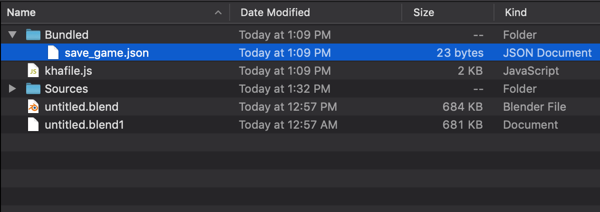

# Part-1

We will implement basics of file reading and writing for `Krom` platform. For now, create `Bundled` folder in root directory, Armory uses this folder to store and read files such as canvas's json.

1. Create a Haxe trait `SaveLoadMechanism`, we will put everything here.

<!-- tabs:start -->

#### **SaveLoadMechanism.hx**

```haxe

package arm;

class SaveLoadMechanism extends iron.Trait {
    public function new() {
        super();

        notifyOnInit(function() {
            //Only compile the code for krom platform
            #if kha_krom
            //Set json structure with text as 'hello World!'
            var saveData = { text: "Hello World!" };
            //Converts above structure to json string.
            var saveDataJSON = haxe.Json.stringify(saveData);
            //Get Krom's location path and add path for save_game.json.
            var path = Krom.getFilesLocation() + "/save_game.json";
            //Write json string to bytes.
            var bytes = haxe.io.Bytes.ofString(saveDataJSON);
            //Save to file from path specified above with data from bytes.
            Krom.fileSaveBytes(path, bytes.getData());
            #end
        });

    }
}
```
---

<details>
    <summary>Code Explanation</summary>

1. `#if some_condition` is called [Conditional Compiling](https://en.wikipedia.org/wiki/Conditional_compilation) expression, here, our code will only be compiled to Krom platform.
2. We define structure and convert the structure into json.
3. We get Krom's file location (during playing from armory, krom's file location is `root_folder/build_file/debug/krom/save_game.json`) and append our `save_game.json` to the path.
4. Convert our stringy json to bytes.
5. Save data from bytes to path specified.
</details>

---
<!-- tabs:end -->

If you play and open `root_folder/build_file/debug/krom/` you should find `save_game.json` and it should have your saved content. To save it to `Bundled` folder that we previously create and to add keyboard input code to save manually instead of saving when the game initiate.

<!-- tabs:start -->

#### **SaveLoadMechanism.hx**

```haxe
package arm;
import iron.system.Input;

class SaveLoadMechanism extends iron.Trait {
    //Get keyboard's input.
    var kb = Input.getKeyboard();

    public function new() {
        super();

        notifyOnUpdate(function() {
            if(kb.started("f")){
                save();
            }
        });
    }

    public function save(){
        ~
        var saveDataJSON = haxe.Json.stringify(saveData);
        // Move out of 3 dirs
        var path = Krom.getFilesLocation() + "/../../../" + "/Bundled/save_game.json";
        var bytes = haxe.io.Bytes.ofString(saveDataJSON);
        ~
        #end
    }
}
```
---

<details>
    <summary>Code Explanation</summary>

1. On every tick, check if key `f` is pressed, than call `save()`
2. We add `/../../../` before path to move out of three directory.
</details>

---
<!-- tabs:end -->



We need to read from file in order to load its contents.

<!-- tabs:start -->

#### **SaveLoadMechanism**

```haxe
package arm;

import iron.system.Input;
import iron.data.Data;

class SaveLoadMechanism extends iron.Trait {

    var kb = Input.getKeyboard();
    var saveFile = "save_game.json";
    public function new() {
        super();

        notifyOnUpdate(function() {
            if(kb.started("f")){
                save();
            }else if(kb.started("g")){
                load();
            }
        });
    }

    public function save() { ~ }

    public function load(){
        //Get Blob, from `Bundled`
        Data.getBlob(saveFile, function(bytes:kha.Blob) {
            //Converts bytes to string.
            var jsonString = bytes.toString();
            //Parse value from stringy json.
            var json = haxe.Json.parse(jsonString);
            trace(json.text);
        });
    }
}
```
---

<details>
    <summary>Code Explanation</summary>

1. Check if `f`, `g` is pressed and then call `save()`, `load()` respectively.
1. Load blob from path specified.
2. Convert the file to string and then parse json from it.
</details>

---

<!-- tabs:end -->

Hit `Play`, try pressing `f` and then `g`, `Hello World!` should appear in debug console, if it do than that means saving and loading works 👌


