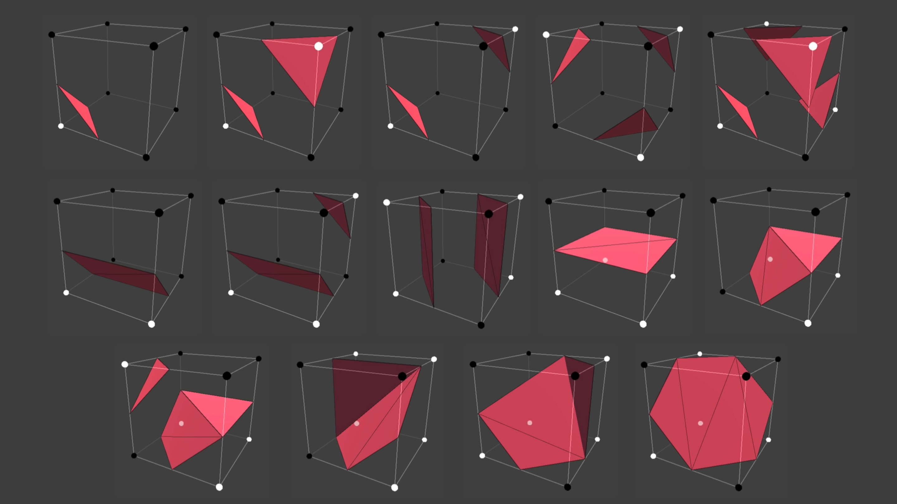

# Introduction

Let say you have [uniform grid of cubes](https://en.wikipedia.org/wiki/Voxel). 8 corners of each cubes has a value (density). Based upon this density, the corner is said to be inside/outside. Now, there are `2^8 = 256` possible amount of configuration of each of this cubes (only 14 of them are unique cases, rest of them are symmetries). And from this configuration, triangle(s) is made almost entirely from triangulation lookup tables, and placed relative to corresponding cube position.

*Image from Sebastian Lague's Coding Adventure: Marching Cubes*

This is performed on each of cubes while iterating (i.e., marching) over the grid, resulting in mesh made up of triangles. This algorithm is called `Marching cubes`.

Example:
<blockquote class="twitter-tweet">
Basics perlin terrain generation<a href="https://twitter.com/hashtag/haxe?src=hash&amp;ref_src=twsrc%5Etfw">#haxe</a> <a href="https://twitter.com/hashtag/yeswekha?src=hash&amp;ref_src=twsrc%5Etfw">#yeswekha</a> <a href="https://t.co/fO3JCygAxk">pic.twitter.com/fO3JCygAxk</a>
&mdash; Blackgoku36 (@UrjasviS) <a href="https://twitter.com/UrjasviS/status/1259098316136222725?ref_src=twsrc%5Etfw">May 9, 2020</a></blockquote> 

*Perlin terrain in marching cubes*

---

Lot of other iso-surface extraction method exists such as:
* Extended Marching Cubes
* Dual Marching Cubes
* Cubical Marching Squares
* Marching Tetrahedra
* Surface Nets
* Dual-Contouring

Different iso-surface extraction algorithm have different up and downs. Two big downs of marching cubes is that it doesn't support sharp features and doing [LOD](https://en.wikipedia.org/wiki/Level_of_detail) is quite difficult. But its big up is that it is easiest and simplest among other methods.

Marching cubes was originally made to visualize data from CT and MRI devices and are still used for it nowadays. Marching cubes are also used in games (such as Astroneer, 7 Days to Die) for procedural and editable terrains.

---

Resources:
* [Polygonising a scalar field (paper)](http://paulbourke.net/geometry/polygonise/)
* [Wikipedia](https://en.wikipedia.org/wiki/Marching_cubes)
* [Nvidia's generating-complex-procedural-terrains-using-gpu](https://developer.nvidia.com/gpugems/gpugems3/part-i-geometry/chapter-1-generating-complex-procedural-terrains-using-gpu)
* [Sebastian Lague's Coding Adventure: Marching Cubes](https://www.youtube.com/watch?v=M3iI2l0ltbE)
* [b3agz's How to Make 7 Days to Die in Unity series](https://www.youtube.com/watch?v=dTdn3CC64sc)
